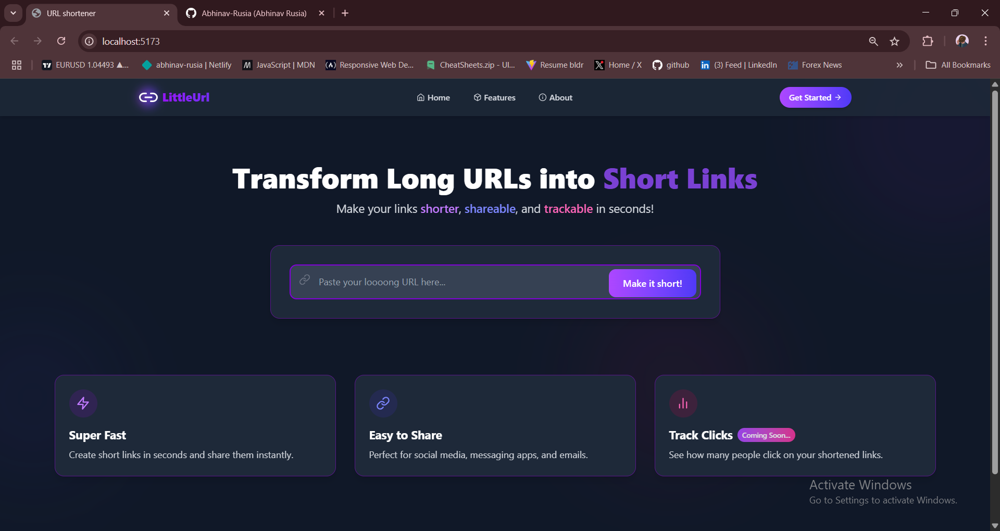

# LittleUrl - Modern URL Shortener



LittleUrl is a sleek, modern URL shortener built with the MERN stack (MongoDB, Express, React, Node.js). It transforms long, unwieldy URLs into short, shareable links with a beautiful, animated user interface.

## ✨ Features

- **Instant URL Shortening**: Convert long URLs to short links in seconds
- **Modern UI/UX**: Sleek design with smooth animations and transitions
- **Responsive Design**: Works perfectly on all devices - mobile, tablet, and desktop
- **Click Tracking**: Track how many times your shortened links have been clicked
- **Copy to Clipboard**: One-click copy functionality for shortened URLs
- **Dark Mode Support**: Seamless experience in both light and dark modes

## 🖥️ Tech Stack

### Frontend
- **React**: UI library for building the user interface
- **Tailwind CSS**: Utility-first CSS framework for styling
- **Framer Motion**: Library for animations and transitions
- **Axios**: Promise-based HTTP client for API requests
- **React Icons**: Icon library for modern, consistent icons

### Backend
- **Node.js**: JavaScript runtime for the server
- **Express**: Web framework for Node.js
- **MongoDB**: NoSQL database for storing URL data
- **Mongoose**: MongoDB object modeling for Node.js
- **Nanoid**: Library for generating unique short URL IDs

## 📸 Screenshots


### Results Display

*Displaying the shortened URL with copy functionality*

### Mobile View

*Responsive design for mobile devices*

## 🚀 Getting Started

### Prerequisites
- Node.js (v14 or higher)
- MongoDB (local or Atlas)
- npm or yarn

### Installation

1. **Clone the repository**
   ```bash
   git clone https://github.com/yourusername/LittleUrl.git
   cd LittleUrl
   ```

2. **Install backend dependencies**
   ```bash
   cd BACKEND
   npm install
   ```

3. **Install frontend dependencies**
   ```bash
   cd ../FRONTEND
   npm install
   ```

4. **Set up environment variables**

   Create a `.env` file in the BACKEND directory:
   ```
   MONGO_URI=your_mongodb_connection_string
   ```

5. **Run the development servers**

   Backend:
   ```bash
   cd BACKEND
   npm run dev
   ```

   Frontend:
   ```bash
   cd FRONTEND
   npm run dev
   ```

6. **Open your browser**

   Navigate to `http://localhost:5173` to see the application running.

## 🏗️ Project Structure

```
URL_ShortenerMERN/
├── BACKEND/                 # Backend code
│   ├── src/
│   │   ├── config/          # Database configuration
│   │   ├── controllers/     # Request handlers
│   │   ├── models/          # Database models
│   │   ├── routes/          # API routes
│   │   ├── services/        # Business logic
│   │   └── utils/           # Utility functions
│   ├── app.js               # Express app entry point
│   └── package.json         # Backend dependencies
│
└── FRONTEND/                # Frontend code
    ├── src/
    │   ├── components/      # React components
    │   │   ├── Navbar.jsx   # Navigation bar component
    │   │   └── UrlShortener.jsx # URL shortening component
    │   ├── animations.css   # Animation styles
    │   ├── App.jsx          # Main App component
    │   ├── index.css        # Global styles
    │   └── main.jsx         # React entry point
    ├── index.html           # HTML template
    └── package.json         # Frontend dependencies
```

## 🔄 How It Works

1. **User enters a long URL** in the input field
2. **Frontend sends the URL** to the backend API using Axios
3. **Backend validates the URL** and checks if it already exists in the database
4. **If new, a short code is generated** using Nanoid
5. **URL is stored in MongoDB** with the original URL, short code, and click count
6. **Backend returns the shortened URL** to the frontend
7. **Frontend displays the shortened URL** with a copy button
8. **When someone visits the short URL**, they are redirected to the original URL and the click count is incremented

## ✨ UI/UX Features

- **Animated Components**: Smooth entrance animations for all UI elements
- **Interactive Elements**: Hover and click animations for buttons and cards
- **Loading States**: Visual feedback during API requests
- **Error Handling**: Animated error messages for invalid inputs
- **Responsive Design**: Adapts to different screen sizes with a mobile-first approach
- **Accessibility**: Keyboard navigation and screen reader support
- **Subtle Background**: Animated gradient blobs that move slowly in the background

## 🚀 Deployment to Vercel

This project is configured for easy deployment to Vercel. Follow these steps to deploy:

### Environment Setup

1. **Create environment variables in Vercel**:
   - `VITE_API_URL`: Your backend API URL (e.g., https://your-app-name.vercel.app)
   - `MONGO_URI`: Your MongoDB connection string

2. **Deploy using the Vercel CLI**:
   ```bash
   # Install Vercel CLI if you haven't already
   npm install -g vercel

   # Login to Vercel
   vercel login

   # Deploy from the project root
   vercel
   ```

3. **Or deploy using the Vercel Dashboard**:
   - Push your code to GitHub
   - Import the repository in the Vercel dashboard
   - Configure the environment variables
   - Deploy

### Project Structure for Deployment

The project includes a `vercel.json` configuration file that:
- Sets up the backend API routes
- Configures the frontend build
- Handles routing between frontend and backend

### Environment Variables

- Development: Uses `.env` files in both FRONTEND and BACKEND directories
- Production: Configured through the Vercel dashboard

## 🛠️ Future Enhancements

- User authentication for managing personal links
- Custom short URLs
- QR code generation for shortened URLs
- Advanced analytics (geographic data, referrer tracking)
- Link expiration options
- Password protection for links
- API documentation for developers

## 📄 License

This project is licensed under the MIT License - see the LICENSE file for details.

## 👨‍💻 Author

Created by [Abhinav Rusia](https://github.com/Abhinav-Rusia)

---

Feel free to contribute to this project by submitting issues or pull requests!
